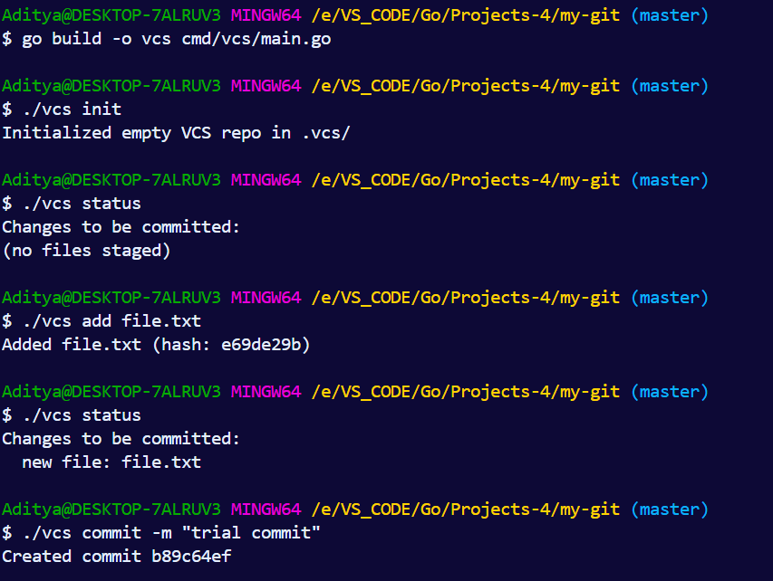

## Implementation of Git

### Object Types

1. **Blob**: Stores file content
2. **Tree**: Represents directory structure with file references
3. **Commit**: Snapshot with tree reference, parent, author, and message

### Storage Model

- Objects are stored in `.vcs/objects/` using SHA-1 hashing
- Files are compressed with zlib
- Directory structure: `.vcs/objects/ab/cdef123...` (first 2 chars as subdirectory)
- Content-addressable: identical content produces identical hash

### Prerequisites
- Go 1.21 or higher

### Usage
